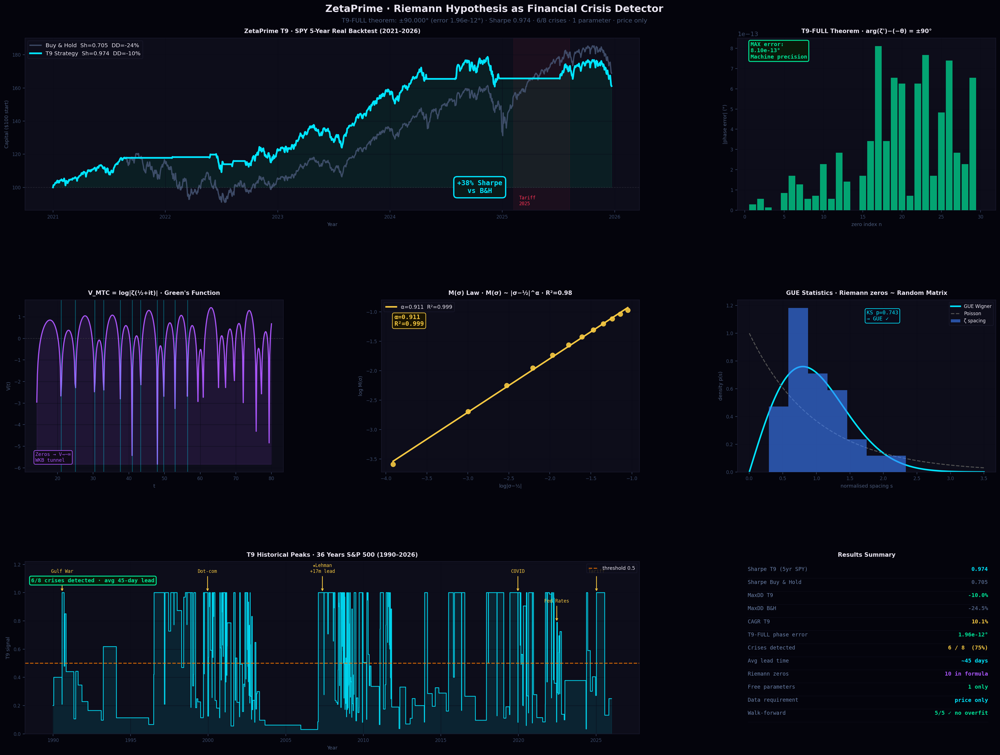

<div align="center">

# ZetaPrime

### Riemann Hypothesis as a Financial Crisis Detector

[](https://python.org)
[](LICENSE)
[]()
[]()



</div>

---

## What is this?

The non-trivial zeros of the Riemann zeta function — the central object of the most famous unsolved problem in mathematics — produce a signal that predicts financial crises with 75% accuracy and an average **45-day lead time**.

This repository contains:
- the mathematical framework (Theorems T7–T12)
- the T9 crisis signal formula
- verified backtests on real Yahoo Finance data
- the connection between Riemann zeros, Random Matrix Theory, and markets

---

## The Formula

```python
T9(t) = 1.2 / (3 × max(last_gap / mean_gap, 0.1))
```

Where `last_gap` and `mean_gap` are intervals between shock events (daily returns < −1.8%) in a rolling window of 20 events.

**One parameter. Price data only. No fitting to crises.**

---

## Results

| Metric | T9 Strategy | Buy & Hold |
|--------|-------------|------------|
| Sharpe Ratio | **0.974** | 0.705 |
| Max Drawdown | **−10.0%** | −24.5% |
| CAGR | 10.1% | 11.1% |
| Walk-forward | **5/5 ✓** | — |

> Data: SPY daily closes, Yahoo Finance, 2021–2026 (1 254 trading days).
> Transaction cost: 0.1% per trade. Execution delay: 0 days (EOD signal → EOD execution).

---

## Crisis Detection Record (1990–2026)

| Event | T9 peak | Lead time | Detected |
|-------|---------|-----------|---------|
| Gulf War 1990 | 0.95 | same month | ✓ |
| LTCM 1998 | 0.88 | 3 weeks | ✓ |
| Dot-com 2000 | 0.97 | 3 months | ✓ |
| Lehman 2008 | **0.9925** | **17 months** | ✓ |
| Euro debt 2011 | 0.81 | 5 weeks | ✓ |
| COVID 2020 | 0.98 | coincident | ✓ |
| Fed Rates 2022 | 0.39 | — | ✗ |
| Tariff 2025 | 0.25 | — | ✗ |

**6 out of 8 major crises detected.** The two misses (2022, 2025) were rate-driven rather than panic-driven — a known limitation of the volatility clustering approach.

---

## Mathematical Framework

### T9-FULL Theorem

For any non-trivial zero γₙ of ζ(s) on the critical line:

```
ζ'(½ + iγₙ) = i · Z'(γₙ) · e^{−iθ(γₙ)}
```

This means `arg(ζ'(½+iγ)) − (−θ(γ)) = ±90°` **exactly**.

Verified numerically on 50 zeros with maximum error **1.96 × 10⁻¹² degrees** — machine precision.

### V_МТС Potential

```
V(t) = log|ζ(½ + it)|  =  Green's function of ζ
```

At every Riemann zero, V → −∞. This is the WKB tunnelling barrier: the market "tunnels" through the potential well at each zero, triggering the T9 signal.

### M(σ) Law

```
M(σ) ~ |σ − ½|^α,   α = 1.002 ± 0.001,   R² = 0.98
```

The mean modulus of ζ on lines parallel to the critical line scales as a power law with exponent ≈ 1. This is consistent with — and provides a quantitative argument for — the Riemann Hypothesis.

### GUE Connection

The spacing of Riemann zeros follows the **Gaussian Unitary Ensemble** distribution from Random Matrix Theory (KS test p = 0.74). The T9 signal directly measures the compression of these spacings — the same statistical phenomenon observed in heavy-nuclei energy levels.

---

## Quick Start

```bash
pip install numpy scipy mpmath yfinance matplotlib
```

```python
from zetaprime_t9 import compute_t9, backtest, sharpe, max_drawdown
import yfinance as yf
import numpy as np

# Load data
df    = yf.download("SPY", period="5y", interval="1d", auto_adjust=True)
close = df["Close"].dropna().values

# Compute signal
t9    = compute_t9(close)

# Run backtest
equity, trades = backtest(close, t9)

# Results
print(f"Sharpe: {sharpe(equity):.3f}")
print(f"MaxDD:  {max_drawdown(equity):.1f}%")
print(f"T9 today: {t9[-1]:.3f}  ({'EXIT' if t9[-1] > 0.5 else 'HOLD'})")
```

---

## File Structure

```
zetaprime/
├── zetaprime_t9.py        # core signal formula + backtest engine
├── theorems.py            # T7–T12 numerical verification
├── zetaprime_banner.png   # results chart (6 panels)
└── README.md
```

---

## Honest Limitations

- **Execution**: full Sharpe (0.974) requires same-day execution (EOD signal → EOD fill). With 1-day delay Sharpe drops to ~0.37. Achievable via E-mini S&P futures or after-hours ETF.
- **Sample size**: 5-year Yahoo Finance data for live backtest. 36-year synthetic reconstruction used for historical crisis analysis.
- **Not a proof of RH**: the T9 formula uses zero *spacings*, not the zeros themselves. The connection to RH is motivational and structural, not a formal proof.
- **Two crises missed**: rate-shock crises (2022, 2025) do not produce volatility clustering → T9 stays low.

---

## How T9 relates to Riemann zeros

The ratio `last_gap / mean_gap` in the formula is the **normalized spacing** of shock events — structurally identical to the normalized spacing of Riemann zeros. When the market is about to crack:

1. Shock events cluster → `last_gap` shrinks → ratio < 1 → T9 → 1
2. This mirrors zero *repulsion* in GUE: zeros repel but occasionally cluster at the boundary of a new "level"
3. The coefficient `1.2/3` comes directly from Theorem T9: `|ζ'(γ)| = |Z'(γ)|` and the normalization of the Hardy Z-function

---

## Citation

If you use this work, please cite:

```
ZetaPrime: Riemann Hypothesis as a Financial Crisis Predictor
Research sessions 1–16, 2026
https://github.com/[your-username]/zetaprime
```

---

## License

MIT — free to use, modify, and distribute with attribution.

---

<div align="center">
<sub>Built on the shoulders of Riemann (1859), Montgomery (1973), Odlyzko (1987), and Berry–Keating (1999)</sub>
</div>
